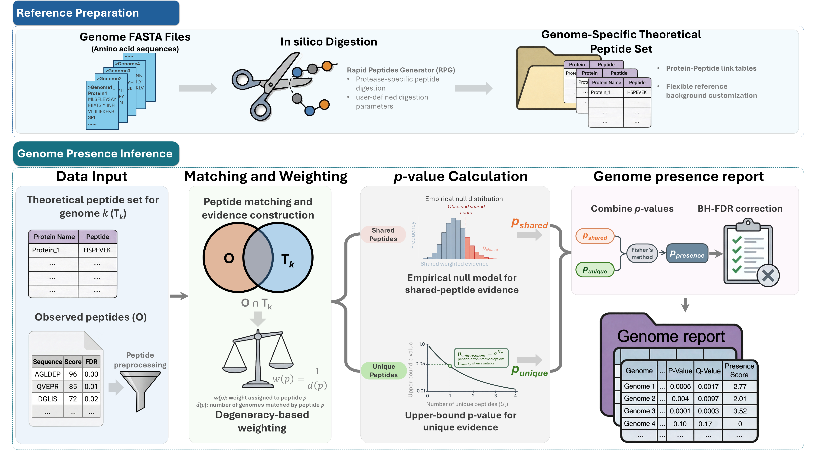

# MetaUmbra

**Genome-level presence inference from metaproteomic peptide lists**

MetaUmbra is a metaproteomics tool for converting identified peptide lists into genome-level statistical evidence. It is designed for user-defined genome collections, including isolate genomes, strain panels, MAG catalogs, and custom microbiome reference sets.

Many metaproteomic peptides are shared across related organisms, which makes genome-level interpretation difficult. MetaUmbra addresses this problem by combining unique peptide support with ambiguity-aware evaluation of shared peptides. The output is a genome-level p-value and BH-adjusted q-value for each candidate genome.

---

## Overview

MetaUmbra follows a two-step workflow:

**Reference Preparation**  
   Protein FASTA files are digested in silico to generate genome-specific peptide tables.

 **Genome presence inference**  
   Observed peptides are matched to the genome-specific references and converted into genome-level statistical significance values.

---

## Main features

- Genome-level presence inference from metaproteomic peptide lists
- Support for user-defined genome or MAG collections
- Retention of both unique and shared peptide evidence
- Degeneracy-aware weighting of shared peptides
- Monte Carlo empirical null model for shared peptide evidence
- BH-adjusted q-values for false discovery control
- GUI and Python workflow support
- Compatible with peptide tables from common metaproteomics workflows such as DIA-NN and MaxQuant

---

## Input

MetaUmbra requires:

- Protein FASTA files, with one FASTA file per genome
- An observed peptide table containing peptide sequences

---

## Output

The main output is a TSV table containing genome-level evidence and significance values.

Key output columns include:

| Column                     | Description                                       |
| -------------------------- | ------------------------------------------------- |
| `genome_id`                | Candidate genome identifier                       |
| `num_peptides_matched`     | Number of observed peptides matched to the genome |
| `num_peptides_unique`      | Number of matched peptides unique to the genome   |
| `weighted_evidence`        | Total degeneracy-weighted peptide evidence        |
| `weighted_evidence_shared` | Weighted evidence from shared peptides            |
| `p_presence`               | Genome-level p-value                              |
| `q_presence`               | BH-adjusted genome-level q-value                  |
| `presence_score`           | Ranking score based on q-value                    |

---

## Citation

If you use MetaUmbra, please cite:

> Wu Q, Zhang A, Ning Z, Cheng K, Figeys D. MetaUmbra: Statistically Controlled Genome-Level Presence Inference from Metaproteomic Peptide Lists.

A formal citation will be added after publication.

---

## Contact

For questions or issues, please use the GitHub issue tracker or contact the corresponding author listed in the associated manuscript.